<div align="center">

# 🏥 EHR Insight and Clinical Validator

### Privacy-aware clinical record retrieval with patient-scoped RAG, PII redaction, and AI guardrails

[](https://www.python.org/)
[](https://fastapi.tiangolo.com/)
[](https://streamlit.io/)
[](https://github.com/pgvector/pgvector)
[](#license)

</div>

## Overview

EHR Insight and Clinical Validator is a clinical retrieval-augmented generation (RAG) application for exploring a selected patient's historical records through a conversational interface.

The system combines a Streamlit frontend, a FastAPI backend, PostgreSQL with pgvector, a domain-specific clinical embedding model, Microsoft Presidio for PII redaction, and NVIDIA NeMo Guardrails for response control. Every retrieval query is scoped to the patient selected in the UI.

> [!CAUTION]
> This project is an educational prototype. Its output is AI generated and must not be used for diagnosis, treatment, medication changes, or other clinical decisions.

## Key features

- **Patient-scoped retrieval** — database searches are filtered by the selected patient ID.
- **Semantic clinical search** — 768-dimensional embeddings retrieve relevant records through pgvector.
- **PII redaction** — Microsoft Presidio removes supported personal identifiers before context reaches the language model.
- **Clinical guardrails** — NeMo Guardrails blocks requests for diagnosis, prescriptions, and medication changes.
- **Searchable patient selector** — the Streamlit UI loads patients dynamically from the API.
- **Conversational interface** — prior messages are preserved during the current UI session.
- **Medical disclaimer** — every generated answer includes an explicit safety notice.

## System architecture

```mermaid
flowchart LR
    U["Clinician / Authorized User"] --> UI["Streamlit UI<br/>Port 8501"]
    UI -->|"Patient ID + question"| API["FastAPI Service<br/>Port 8000"]

    API --> EMB["BioClinical ModernBERT<br/>Question embedding"]
    EMB --> DB[("PostgreSQL + pgvector<br/>patient_encounters")]
    API -->|"subject_id filter"| DB
    DB -->|"Top matching records"| PII["Microsoft Presidio<br/>PII redaction"]
    PII --> GR["NVIDIA NeMo Guardrails<br/>Policy enforcement"]
    GR --> LLM["Groq OpenAI-compatible API<br/>openai/gpt-oss-120b"]
    LLM -->|"Guarded response"| API
    API --> UI
    UI -->|"Answer + disclaimer"| U

    classDef interface fill:#e8f3ff,stroke:#1677ff,color:#102a43
    classDef security fill:#fff3cd,stroke:#d39e00,color:#4a3b00
    classDef data fill:#e9f7ef,stroke:#238636,color:#123b20
    class UI,API interface
    class PII,GR security
    class EMB,DB,LLM data
```



### Request flow

1. The user selects a patient and asks a question in Streamlit.
2. FastAPI converts the question into a 768-dimensional clinical embedding.
3. PostgreSQL searches only records belonging to the selected patient.
4. Presidio redacts supported PII from the retrieved context.
5. NeMo Guardrails evaluates the request and controls the model response.
6. The answer returns to the UI with a medical-use disclaimer.

## Technology stack

| Layer | Technology | Purpose |
|---|---|---|
| User interface | Streamlit | Searchable patient selector and chat |
| API | FastAPI + Uvicorn | Request validation and RAG orchestration |
| Database | PostgreSQL | Clinical encounter storage |
| Vector search | pgvector | Semantic similarity search |
| Embeddings | NeuML BioClinical ModernBERT | Clinical text embeddings |
| PII protection | Microsoft Presidio + spaCy | Detection and anonymization |
| Guardrails | NVIDIA NeMo Guardrails | Clinical safety rules |
| LLM access | Groq OpenAI-compatible endpoint | Response generation |

## Repository structure

```text
.
├── data/
│   ├── MIMIC_IV_Trasncript.csv
│   └── instructions/
├── scripts/
│   ├── 01_ingest_baseline_data.py
│   ├── 02_verify_ingestion.py
│   ├── 03_apply_vector_schema.py
│   ├── 04_generate_embeddings.py
│   ├── 05_test_vector_search.py
│   └── 06_test_guardrails.py
├── src/
│   ├── api/main.py
│   ├── database/schema.sql
│   ├── guardrails/
│   │   ├── config.yml
│   │   └── rails.co
│   ├── pii_redaction/presidio_service.py
│   └── ui/app.py
├── requirements.txt
└── README.md
```

## Prerequisites

- Python 3.12
- PostgreSQL with the pgvector extension
- A Groq API key
- Access to a PostgreSQL database containing the clinical dataset
- Sufficient memory and disk space for the embedding model

## Local setup

### 1. Clone the repository

```bash
git clone https://github.com/tejasrs77/EHR-Insight-and-clinical-validator.git
cd EHR-Insight-and-clinical-validator
```

### 2. Create and activate a virtual environment

**Windows PowerShell**

```powershell
python -m venv .venv
.\.venv\Scripts\Activate.ps1
```

**Linux or macOS**

```bash
python3 -m venv .venv
source .venv/bin/activate
```

### 3. Install dependencies

```bash
python -m pip install --upgrade pip
pip install -r requirements.txt
```

### 4. Configure environment variables

Create a local `.env` file in the project root:

```dotenv
DB_HOST=127.0.0.1
DB_PORT=5432
DB_NAME=ehr_db
DB_USER=your_database_user
DB_PASSWORD=your_database_password

OPENAI_API_KEY=your_groq_api_key
OPENAI_BASE_URL=https://api.groq.com/openai/v1
OPENAI_API_BASE=https://api.groq.com/openai/v1
```

Never commit `.env` or API keys. If a key is exposed, revoke it immediately and create a replacement.

## Prepare the database

Run these scripts in order from the project root:

```bash
python scripts/01_ingest_baseline_data.py
python scripts/02_verify_ingestion.py
python scripts/03_apply_vector_schema.py
python scripts/04_generate_embeddings.py
python scripts/05_test_vector_search.py
python scripts/06_test_guardrails.py
```

The embedding step downloads the clinical model the first time it runs and can take several minutes. Patient records appear in the UI only after their `clinical_embedding` values have been generated.

## Run the application

Open two terminals with the virtual environment activated.

**Terminal 1 — FastAPI**

```bash
python -m uvicorn src.api.main:app --host 127.0.0.1 --port 8000
```

**Terminal 2 — Streamlit**

```bash
streamlit run src/ui/app.py
```

Then open [http://localhost:8501](http://localhost:8501).

Useful API pages:

- OpenAPI specification: [http://localhost:8000/openapi.json](http://localhost:8000/openapi.json)
- Interactive API docs: [http://localhost:8000/docs](http://localhost:8000/docs)
- Patient list: [http://localhost:8000/api/v1/patients](http://localhost:8000/api/v1/patients)

## API endpoints

| Method | Endpoint | Description |
|---|---|---|
| `GET` | `/api/v1/patients` | Returns patient IDs with generated embeddings |
| `POST` | `/api/v1/chat` | Runs patient-scoped RAG and returns a guarded answer |
| `POST` | `/api/v1/clinical-query` | Demonstrates redaction and guardrails using mock context |

Example chat request:

```json
{
  "patient_id": "10004720",
  "messages": [
    {
      "role": "user",
      "content": "What medications were recorded for this patient?"
    }
  ]
}
```

## Security design

- The selected `subject_id` is applied in the SQL retrieval query.
- Only rows with generated embeddings participate in semantic search.
- Retrieved clinical context is redacted before it is sent to the LLM.
- Guardrails refuse requests for diagnoses, prescriptions, treatment recommendations, or dose changes.
- Secrets are loaded from environment variables.
- The UI labels responses as AI-generated summaries.

These controls reduce risk but do not make the prototype production-ready or establish regulatory compliance. A production deployment would also require authentication, role-based authorization, encryption, audit logging, secret management, monitoring, data-retention controls, and formal clinical validation.

## Troubleshooting

**The patient list is empty or contains only one patient**

Verify how many patients have embeddings:

```sql
SELECT subject_id, COUNT(*)
FROM patient_encounters
WHERE clinical_embedding IS NOT NULL
GROUP BY subject_id
ORDER BY subject_id;
```

Run `scripts/04_generate_embeddings.py` again if the required patients have no embeddings.

**The UI remains on “Running fetch_patient_list()”**

Confirm that FastAPI is running and that `http://127.0.0.1:8000/api/v1/patients` responds. If the application and database run on separate servers, also verify that PostgreSQL port `5432` is allowed from the application server.

**The model download is slow**

Set an optional Hugging Face token in the environment to receive higher Hub rate limits:

```dotenv
HF_TOKEN=your_hugging_face_token
```

## Responsible use

This repository processes healthcare-related information. Use only de-identified or properly authorized data, follow the dataset's license and access rules, and avoid exposing database credentials or patient information in logs, screenshots, commits, or public deployments.

## License

No license has been added yet. Add a `LICENSE` file before distributing or reusing this project.
